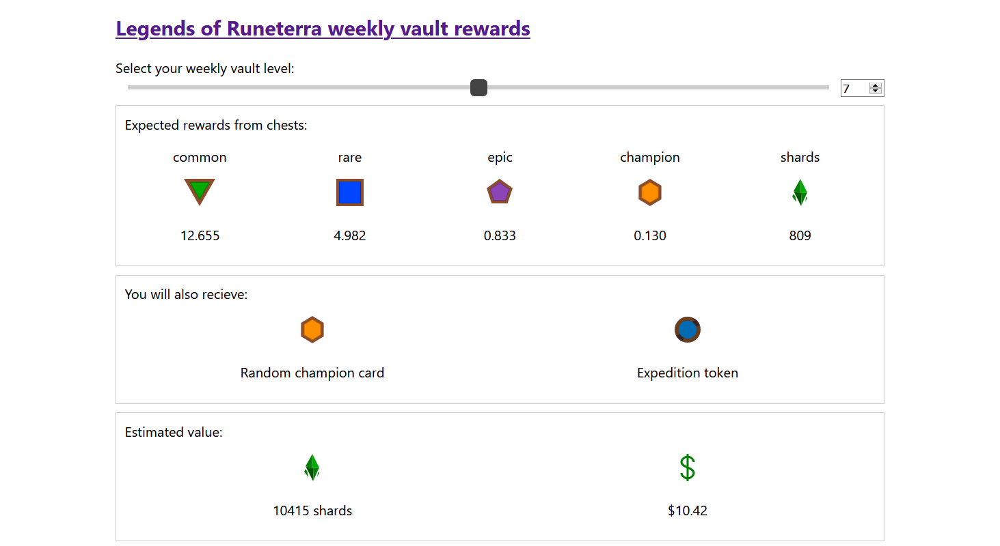

    <h3 align="center">lor-rewards</h3>
    

        Legends of Runeterra weekly vault rewards calculator
         
        <a href="https://szebniok.github.io/lor-rewards"><strong>Open in browser &#187;</strong></a>
    

## About the project

This project is a simple calculator that aims to estimate expected value of weekly vault rewards in [Legends of Runeterra](https://playruneterra.com). 

It is available at [https://szebniok.github.io/lor-rewards](https://szebniok.github.io/lor-rewards)

## Built with

- [Next.js](https://nextjs.org/)
- [react-range](https://github.com/tajo/react-range)
- [react-transition-group](https://reactcommunity.org/react-transition-group/)

## License

Distributed under the MIT License. See `LICENSE` for more information.

## Disclaimer

This project is unofficial, the numbers shown here may be incorrect.

lor-rewards isn't endorsed by Riot Games and doesn't reflect the views or opinions of Riot Games or anyone officially involved in producing
or managing Riot Games properties. Riot Games, and all associated properties are trademarks or registered trademarks of Riot Games, Inc.